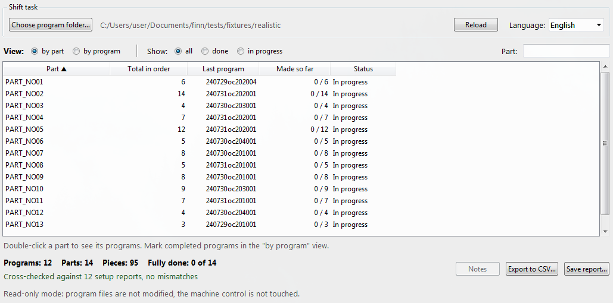
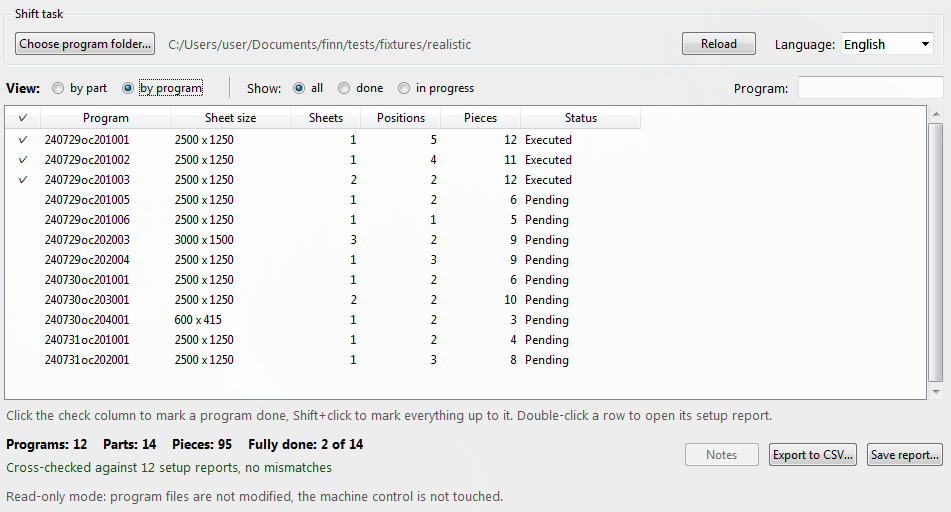
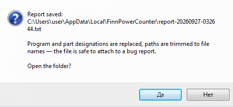

# CNC Part Completion Tracker


**English** · [Русский](README.ru.md)

A shop-floor utility that tells a CNC punching machine operator which
positions of a shift task are already complete and which are still being cut.
It reads the NC program files, works out how many pieces of each part the
shift produces, and tracks what has been made so far.

Read-only. Program files are never modified and the machine control is not
touched.



---

## The problem

A punching order is not a production line. One shift task contains many
different parts in different quantities. To avoid wasting expensive sheet
metal on a single position, the CAM system nests different parts onto shared
sheets.

As a result a single position comes out in pieces across the whole shift.
For example, 20 pieces of one part are cut like this:

| Program | Pieces |
|---|---|
| PRG_04 | 2 |
| PRG_05 | 2 |
| PRG_07 | 4 |
| PRG_10 | 5 |
| PRG_27 | 2 |
| PRG_28 | 5 |

The position is only closed on the 28th program out of 30.

The operator needs the current balance: what is 100 % done and what is still
in progress. By hand this means sticky notes on pallets, or pen marks across
a stack of printed setup reports, plus a desk calculator. At shift handover
that falls apart: the metal is mixed up on pallets and the incoming operator
cannot tell which positions are closed.

Meanwhile the next process cannot accept parts in batches — any further
operation needs a tooling changeover. An incomplete set means idle equipment
downstream.

---

## How it counts

The logic is simple and can be checked by hand:

1. The program declares the number of sheets — `SHEET_COUNT`.
2. Each part on the sheet declares a quantity — `QUANTITY`. One part may
   appear in several `PART_DATA` blocks of the same file; the quantities are
   summed.
3. Pieces in this program = sheets × quantity per sheet.
4. Scrap contours (`SCRAP`) are ignored.
5. Across the shift the utility totals each position and records the **last
   program** it appears in. That is the point where the position reaches
   100 %.

Execution order comes from a natural sort of the file names; the programs are
then numbered by their place in the task. The number embedded in a file name
cannot be trusted — see the configuration section.

The operator ticks off completed programs in the "by program" view: a click
marks one, Shift+click marks everything up to it. Completions are stored as a
set rather than a single number, because programs are not always run in
order.



Double-clicking a position opens a window showing where it is cut, how many
per program and the running total. Double-clicking a program opens its setup
report.

### Self-check

Next to each program sits a setup report `.fms` — the same numbers recorded
independently and in two forms: the `#RSCUT` section gives the total per part,
the `#COMPONENTS` section the per-block breakdown.

The utility compares all three sources and shows the result in the window.
If anything disagrees, the operator sees it instead of silently getting a
wrong balance.

---

## Compatibility

Verified against output of the **NCeXpress FMS** postprocessor for a
Prima Power / Finn-Power punching machine. A real 30-program shift task
parses with no mismatches against its setup reports; a further 8764 real
setup reports parse without a single failure.

About other equipment, honestly: **not tested and not known.**

The format is determined by the postprocessor, not by the machine. If your
shop uses the same NCeXpress, the files are probably the same. A different
postprocessor means different syntax, and the utility will not understand it
until it is configured.

There are no promises here about "works for laser, plasma and milling". A
second machine was tried — an Accure Max with Fanuc-style output — and it
does not work: those files carry `(SHEETS 1)` and `(PARTS 25)` but **no
per-part breakdown at all**. No amount of configuration recovers data that is
not in the file.

A quick way to tell: open your `.nc` in a text editor and look for the sheet
count and a list of parts with quantities. If both are there, it can be
configured. If not, it cannot.

### Adapting to another machine

All machine-specific parsing lives in one place —
[`finnpower_counter/core/syntax.py`](finnpower_counter/core/syntax.py), in the
`MachineSyntax` object. It holds the regular expressions for sheet count,
part block, name and quantity, plus the scrap names and the encodings to try.

Build your own `MachineSyntax`; nothing else changes.

A few places where naive parsing breaks, worth knowing when you configure it:

- **`SHEET_COUNT` appears twice in the file.** The second time is inside the
  jump condition `IF (SHEET_COUNT > R400) ... GOTOB MAIN` at the end of the
  program. That is not a declaration. The pattern is anchored to the start of
  a line.
- **One part sits in several blocks** of the same file. Quantities must be
  summed, not overwritten. In the test task that is 18 files out of 30.
- **Program order comes from neither the alphabet nor the number in the
  name.** Alphabetically `PRG_10` sorts before `PRG_9`. And if you take the
  last group of digits, then on names like `000101zz201001` — date plus code
  plus number — the sequence is neither increasing nor unique: programs from
  different dates share the same tail. On real data that broke the ordering
  for 22 % of batches. A natural sort of the file name handles all three
  cases: with leading zeros, without them, and with a date in the name.
- **The encoding is chosen by how plausible the text looks.** Single-byte
  encodings accept almost any byte, so "the first one that did not fail"
  always yields cp1251.

---

## Running

Python 3.8 or newer. No external dependencies.

Window:

```bash
python app.py
```

Console — a development aid, not part of the release:

```bash
python -m finnpower_counter --dir FOLDER --done 15 --validate
```

Options: `--dir`, `--done`, `--mode {parts,programs}`,
`--only {all,done,work}`, `--search`, `--sort`, `--desc`, `--validate`,
`--json`, `--report`, `--lang {en,ru}`.

### Language

Russian and English. Detected from the system, switchable in the window or
with `--lang`.

To add a language, add a dictionary with the same keys to
[`finnpower_counter/i18n.py`](finnpower_counter/i18n.py). Missing keys fall
back to English, so a translation can be done in parts.

### Building

The release target is Windows 7 32-bit, because that is what the machine
control runs. The last Python that installs on it is 3.8.10. Build in that
same environment: PyInstaller does not cross-compile.

```bash
pyinstaller app.spec
```

Everything that differs from the defaults lives in [`app.spec`](app.spec)
rather than in command-line flags, so the build reproduces identically. The
resulting file needs no Python installation and no internet.

The version lives in one place — `finnpower_counter/__init__.py`. It is also
shown in the window title and included in error reports, so a bug report always
says which build it came from.

> One-file executables built by PyInstaller regularly trigger false positives
> in antivirus software. That is a property of the packer, not a sign of a
> problem with the code. UPX is therefore disabled and a checksum is attached
> to each release.

---

## When something goes wrong

The build uses `--noconsole`, so a traceback would otherwise vanish without
trace. Instead it is written to a file.

**On a crash** the report is saved automatically, the window shows the path
and offers to open the folder. The window stays open.

**Without a crash** — the "Save report…" button at the bottom of the window,
or `--report` on the console. Useful when the numbers disagree but nothing
has failed.

Where it goes: `%LOCALAPPDATA%\FinnPowerCounter` on Windows,
`~/.local/share/finnpower-counter` elsewhere. Never next to the executable:
on a shop-floor machine that folder may be read-only.



### What is in the report

Utility and environment versions, the traceback, the operator's last actions
and an outline of the shift task: how many programs, sheets, positions and
pieces in each.

The report is **anonymised by construction**. Program and part designations
are replaced with `PRG_NN` and `PART_NN`, paths are trimmed to file names.
The substitution is stable within a report, so it is visible which program
relates to which, but not what the parts are or whose order it is.

Verified on a real 118-program shift task: none of the 281 plant designations
made it into the report.

Do not attach `.nc`, `.fms` or setup report files to bug reports — they
contain plant data, and the report is enough to work from.

---

## Data

Real shop files are not published in this repository. Everything here —
including the screenshots above — is synthetic, produced by
[`tools/make_fixtures.py`](tools/make_fixtures.py).

The generator deliberately reproduces the format quirks listed above,
including repeated blocks, the second `SHEET_COUNT` occurrence, CRLF line
endings, single-byte encodings and real-style file names.

```bash
python -m pytest tests -q
```

The expected balance is computed from the task description rather than from
parsing the generated files, so the parser is checked by an independent path.
A separate set of tests runs against a real shift task when one is available
locally; the path is given by `FINNPOWER_DATASET`.

---

## Roadmap

The utility is growing from a single-workstation tool into a small production
tracking system: a server with a database, the utility as the operator's
client, and a web page for the shift supervisor. Nothing below is implemented
yet.

| Stage | What it brings |
|---|---|
| 0 | Windows 7 compatibility checks, client groundwork — no visible change |
| 1 | Server: users and roles, workstations, admin web panel, Docker deployment |
| 2 | Client connects: workstation registration, operator sign-in with name and PIN, offline sign-in |
| 3 | Production log: every mark recorded on the server, outbox when offline, live updates across workstations |
| 4 | Supervisor web page: production per operator, day, shift and task; CSV export |
| 5 | Saved sessions: named bookmarks with date and time |
| 6 | Operations: backups, installation guide, update notices |
| A–F | More data from the machine files: material, time, weight, order, automatic detection of executed programs |

Standalone mode stays: without a server the utility works exactly as it does
now, and program files remain read-only.

Details:

- [docs/ROADMAP.md](docs/ROADMAP.md) — stages and decisions
- [docs/ARCHITECTURE.md](docs/ARCHITECTURE.md) — client–server design and why
- [docs/TASKS.md](docs/TASKS.md) — task breakdown with acceptance criteria
- [docs/FINDINGS.md](docs/FINDINGS.md) — audit results and planning findings

The repository is maintained in English; Russian versions (`*.ru.md`) are
translations and may lag behind.

---

## License

[MIT](LICENSE). Use it, change it, build it for your own equipment.

The software is provided as is, without warranty of any kind. Responsibility
for the correctness of accounting at a particular plant lies with whoever
applies it.

---

## Disclaimer

This project is unofficial and not affiliated with Prima Power, Finn-Power or
the developers of NCeXpress. Equipment and software names are used solely to
describe the file format and belong to their respective owners.

The utility does not control the machine, does not alter cutting paths and
does not interfere with the machine control. It is an auxiliary accounting
tool that works on copies of text files.
